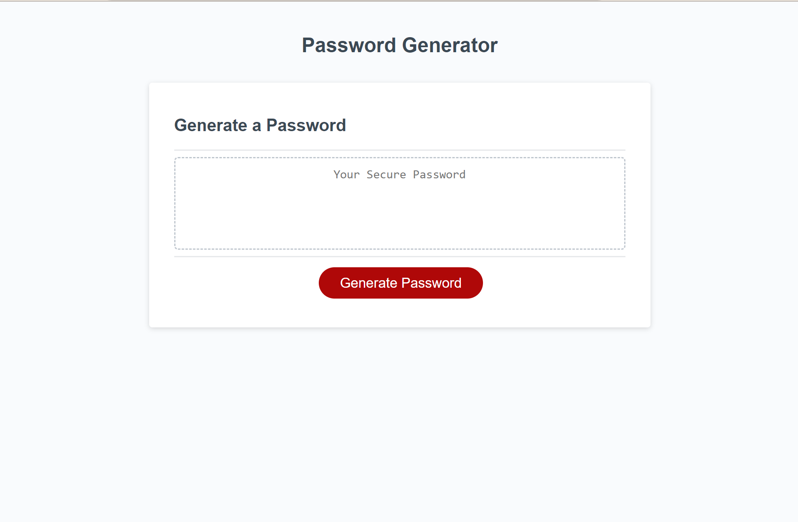

# Random Password Generator

## Description

The purpose of this assignment was to create a random password generator using JavaScript. This project was valuable for me because it taught me a lot about keeping my code simple and not overcomplicating things. I have a much better understanding on if statements, functions and the proper syntax.

## Usage

This webpage consists of a random password generator with prompts that allow the user to choose what character types they would like included in their password as well as how many characters they want there password to consist of. If the user does not input a number between 8-128, if it is not a number or they do not choose a prompt it will return them to the webpage. 

